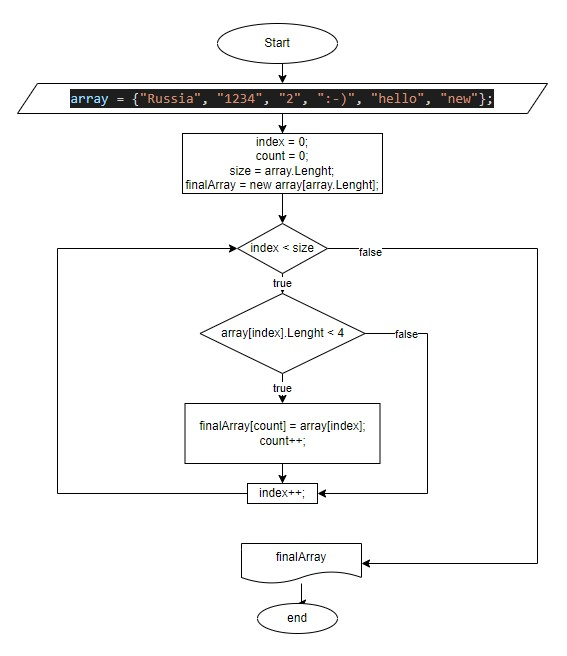

# Итоговая работа

## Поставленная задача

Написать программу, которая из имеющегося массива строк формирует массив из строк, длина которых меньше либо равна 3 символа. При решении не рекомендуется пользоваться коллекциями.

## Решение

1. Созданы 2 массива (заданный и новый, в который будем кидать необходимые элементы первого массива)
2. Добавлен метод, который проверяет каждый элемент заданного массива. При выполнении условия подходящий элемент записывает в новый массив.
3. Добавлен метод по распечатке нового массива.

## А вот и блок-схема
